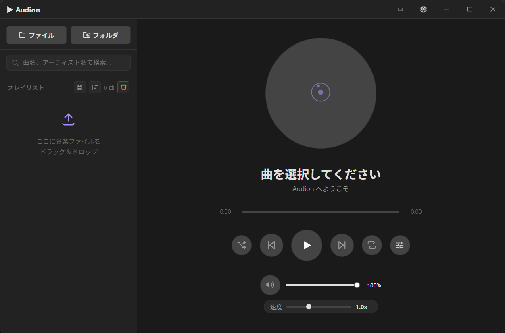
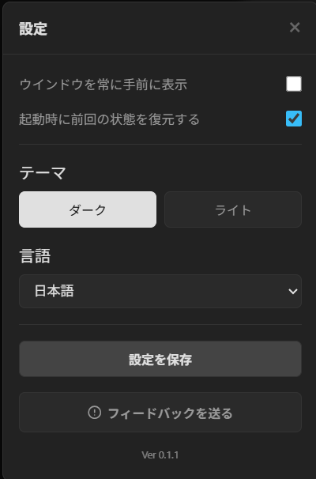
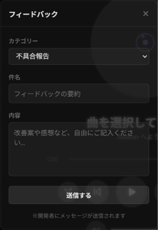
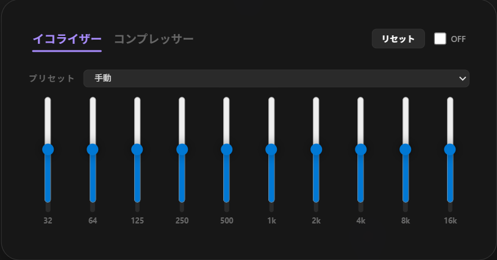
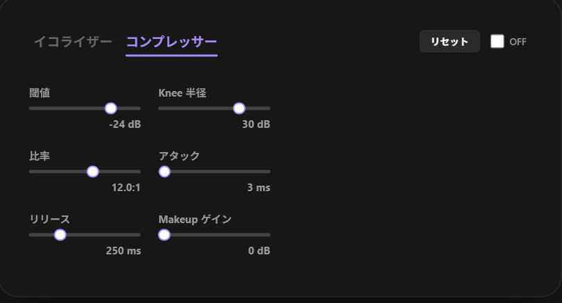
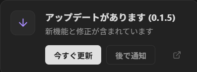

# Audion

<div align="center">
  
  <br>
  <p><strong>Tauri Base Music Player</strong></p>

  
  
  
  
  
  <br>
  
  
</div>

## Audionについて

Audionは、Tauri v2 + Reactで作られたWindows向けの軽量音楽プレイヤーです。

- 対応フォーマット:
  <p>
    
    
    
    
    
    
    
  </p>
- インストーラー配布: `.msi`, `.exe`
- ライセンス: [MIT License](LICENSE)

## Deep Link

### AudionはDeep Linkに対応しています。

### 対応リンク

- `audion://home`
- `audion://settings`
- `audion://report`


## スクリーンショット

<div align="center">
  <h3>メイン画面</h3>
  
  <br>

  <h3>設定画面</h3>
  
  <br>

  <h3>フィードバック画面</h3>
  

  <h3>イコライザー</h3>
  

  <h3>コンプレッサー</h3>
  

  <h3>リバーブ・ディレイ</h3>
  

  <h3>アプリの更新通知</h3>
  
</div>

---

## セットアップ

### 前提環境

1. [Rust](https://www.rust-lang.org/ja/tools/install) をインストール
2. [Node.js](https://nodejs.org/) をインストール
3. このリポジトリをクローン

### 開発・ビルド

```bash
# 依存関係をインストール
npm install

# 開発モードで起動
npm run tauri dev

# 本番ビルド (.msi) を作成
npm run tauri build
```

---

## リリース

- 最新版: [GitHub Releases](https://github.com/sagami121/Audion/releases)
- 変更履歴: [Changelog.txt](Changelog.txt)
