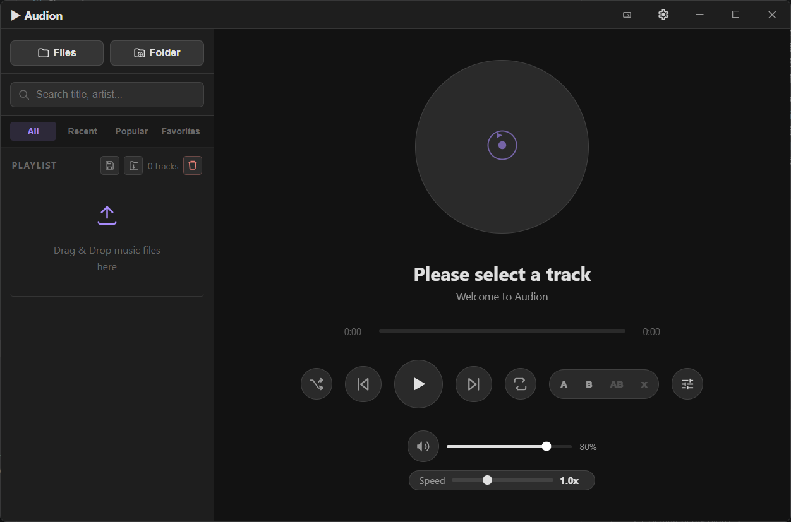
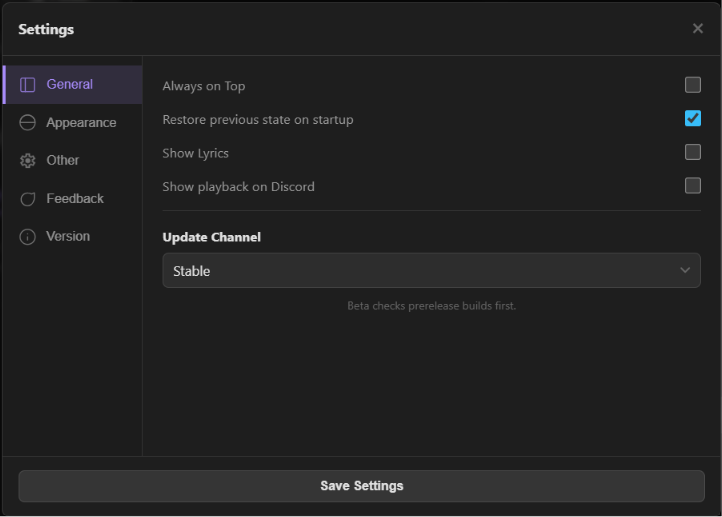
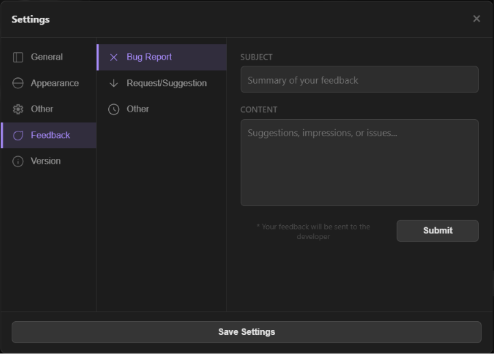
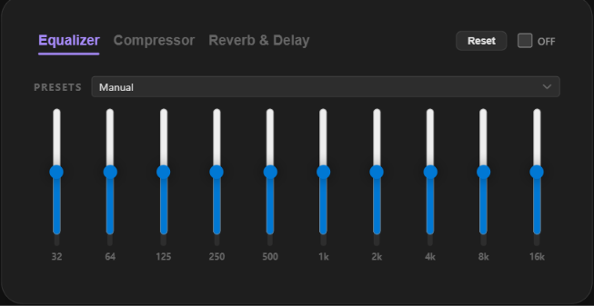
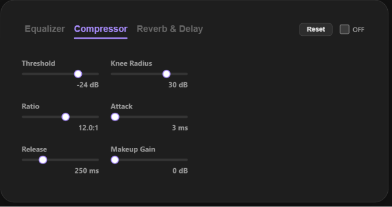
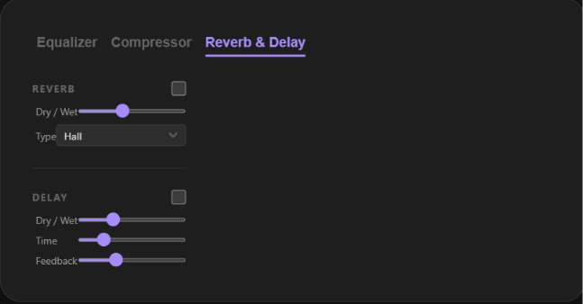
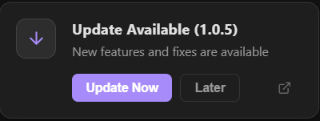

# Audion

<div align="center">
  
  <br>
  <p><strong>Tauri-based Music Player</strong></p>


<br>


</div>

[日本語版のREADMEはこちら](README_ja.md)

## About Audion

Audion is a lightweight music player for Windows built with Tauri v2 and React.

- Supported formats
  <p>
    
    
    
    
    
    
    
  </p>
- Installer distribution: `.exe`
- License: [MIT License](LICENSE)

## Features

- Add songs from individual files or entire folders
- Drag and drop music files directly into the playlist
- Search by title or artist
- Switch playlist views between all tracks, recently added tracks, popular tracks, and favorites
- Save and load playlists
- Adjust playback speed, shuffle, repeat, and volume
- Show lyrics when available
- Use audio effects such as equalizer, compressor, reverb, and delay
- Customize the theme, language, UI opacity, and playlist position
- Check for updates from the app
- Show the currently playing track on Discord

## Deep Link

### Audion supports deep links.

### Supported Links

- `audion://home`
- `audion://settings`
- `audion://settings/general`
- `audion://settings/appearance`
- `audion://settings/other`
- `audion://settings/version`
- `audion://report`

## Screenshots

<div align="center">
  <h3>Main Screen</h3>
  
  <br>

  <h3>Settings Screen</h3>
  
  <br>

  <h3>Feedback Screen</h3>
  

  <h3>Equalizer</h3>
  

  <h3>Compressor</h3>
  

  <h3>Reverb and Delay</h3>
  

  <h3>App Update Notification</h3>
  
</div>

---

## Setup

1. Install [Rust](https://www.rust-lang.org/tools/install)
2. Install [Node.js](https://nodejs.org/)
3. Clone this repository

### Development and Build

```bash
# Install dependencies
npm install

# Run in development mode
npm run tauri dev

# Create a production build (.exe)
npm run tauri build
```

---

## Release

- Latest version: [GitHub Releases](https://github.com/sagami121/Audion/releases)
- Changelog: [Changelog.txt](Changelog.txt)
